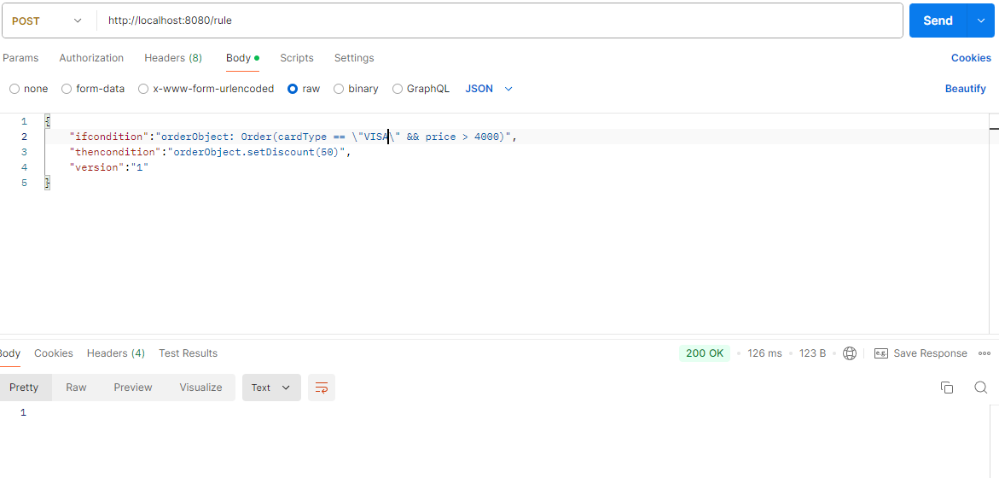

# DroolRuleEngineDiscountAndClaimJDK17

## Overview

1. <b>Spring Boot application that integrates the Drools rule engine to process business rules for order discounts and claim risk levels.</b>
2. <b>This application allows for dynamic rule management, enabling you to define, update, and apply custom rules to orders and claims via a RESTful API.</b>

## Key Features

- **Dynamic Rule Management**: Define new rules for orders and claims via the API.
- **Drools Integration**: Leverage the Drools engine to process complex business logic.
- **REST API**: Expose endpoints to apply rules to orders and claims.
- **Persistence**: Store rules using Spring Data JPA with an underlying database.

## Screenshots, test scenario #1

### 1. Creating new rule, if CardType=Visa, and price more than $4000, discount set to 50%

### 2. We are apply the new rule, CardType=Visa, and price more than $4000, so our discount is 50%, 

### 2.1 If we use MasterCard, discount is 0, as no rule set for MasterCard


## Screnshots, test scenario #2
### 1. We can edit Claim rules based on what we want, we can define/create new rules


The project implements two key functionalities:

1. **Order Discount Processing**: Calculates discounts based on order attributes such as card type and price.
2. **Claim Risk Evaluation**: Determines the risk level of insurance claims based on predefined rules.

You can easily add, manage, and update rules through the provided API.


## Project Structure

- `com.springproject.droolEngineProject`
  - `service`: Contains the business logic for processing orders and claims.
  - `controller`: RESTful controllers for handling API requests.
  - `model`: Defines the data models (e.g., `Order`, `Claim`, `Rule`).
  - `repo`: JPA repository for managing rule persistence.
  - `config`: Configuration files for setting up the Drools environment.
  - `rules`: Contains the DRL (Drools Rule Language) files for predefined business rules.

## APIs

### 1. Add new rule, setting Discount


* **POST** `/rule`: Add a new rule.


```bash
  **Request**:

    {
      "ifcondition": "orderObject: Order(cardType == "MasterCard" && price > 4000)",
      "thencondition": "orderObject.setDiscount(10)",
      "version": "1"
    }
```

### 2. Apply the new rule


* **POST** `/getDiscount`: Apply discount rules to an order.

```bash
  **Request**:

    {
      "name": "first",
      "cardType": "MASTERCARD",
      "price": 50000
    }
```


```bash
  **Response**:

    {
      "name": "first",
      "cardType": "MASTERCARD",
      "discount": 10,
      "price": 50000
    }
```


### 2. Claim Risk Evaluation API / Claim rules can be edited (src/main/resources/rules/claim-rules.drl)

* **POST** `/api/getClaimRisk`: Evaluate the risk level of a claim.

```bash
  **Request**:

    {
      "type": "high"
    }
```

```bash
  **Response**:

    {
      "type": "high",
      "riskLevel": "High",
      "message": "High risk claim detected."
    }
```

### 3. Rule management / Storage: H2


* **GET** `/rules`: Retrieve all rules.

```bash
  **Response**:

    [
      {
        "id": 1,
        "ifcondition": "orderObject: Order(cardType == "MasterCard" && price > 4000)",
        "thencondition": "orderObject.setDiscount(50)",
        "version": 1
      }
    ]
```


## Running the Application

### Prerequisites

- Java 17
- Maven
- H2 db

### Build and Run

1. Clone the repository:
```bash
 git clone https://github.com/csabika98/DroolRuleEngineDiscountAndClaimJDK17.git
 cd DroolRuleEngineDiscountAndClaimJDK17
```
2. Build the project:
```bash
    mvn clean install
```
3. Run the application:
```bash
    mvn spring-boot:run
```
4. Access the APIs via http://localhost:8080.

## Customizing Rules

You can define custom rules for processing orders and claims by adding or updating the rules through the provided API endpoints. 

For example, to add a new rule:

    {
      "ifcondition": "orderObject: Order(cardType == "Visa" && price > 10000)",
      "thencondition": "orderObject.setDiscount(15)",
      "version": "1"
    }

## Technologies Used

- Spring Boot: Framework for building Java-based applications.
- Drools: A rule engine for processing business logic.
- Spring Data JPA: For data persistence.
- RESTful API: For interacting with the rule engine.
- Maven: Build and dependency management.

